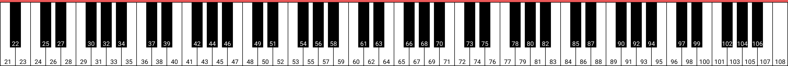

# 🎹 Midirect

Command-line tool that translates MIDI input as computer keyboard input in real time.

## Building

You need to have Rust installed.

To build the app, run the following command from the root directory:

```
cargo build --release
```

This will generate a binary called `midirect` and store it in `./target/release/`.

## Tutorial

Prepare a configuration file which specifies which MIDI signals are mapped to which keyboard keys. You can use the existing `./rsc/alphabet.json` or `./rsc/arrows.json` configs for inspiration.

The content of the configuration file should be a JSON with two parameters: `notes` and `controls`. 

Entries in `notes` represent note on/off signals. Each note has a code between `0` and `127`. For reference, this is the layout of notes on a 88-key piano:



Entries in `controls` are for control change events, like pressing a sustain pedal (code `64`). Any non-zero value emitted by a control is mapped to a key press, and zero is mapped to a key release.

In both `notes` and `controls`, MIDI signals are mapped to keys on a computer keyboard. All possible values include keys represented by characters, such as `a` and `1`, as well as special keys from the following list:

```
alt        backspace   caps_lock  control
delete     down_arrow  end        escape
f1         f2          f3         f4
f5         f6          f7         f8
f9         f10         f11        f12
home       left_arrow  meta       option
page_down  page_up     return     right_arrow
shift      space       tab        up_arrow
```

Here is an example of mapping some piano keys to WASD and a sustain pedal to the space bar:

```json
{
    "notes": {
        "48": "a",
        "50": "w",
        "52": "d",
        "53": "s"
    },
    "controls": {
        "64": "space"
    }
}
```

Once you have your configuration file ready, pass it to the app as a command line argument:

```
midirect config.json
```

## Limitations

- A MIDI device must be connected before starting the app.
- Only a single MIDI device can be used at a time. If there are more MIDI devices, the app will pick one of them.

## Compatibility

The app has been tested to work on Windows and macOS.
